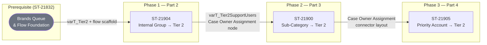

# Orchestration Plan

## Summary

Three strictly sequential Flow updates to Brands_Omni_Channel_Routing add Tier 2 routing paths in numbered part order: internal group membership check (Part 2), sub-category match (Part 3), and priority account flag lookup upstream of the decision node (Part 4).

## Diagram

## Phases (sequence groups)

### Phase 1

- **ST-21904: Internal Route to Tier 2 (Part 2)** ← builtin-sf-developer · branch `agent/st-21904-internal-tier2-routing`
  *Why:* Flow modification adding a new 'Brands Tier 2 Support Users' decision path, a text variable, a Get Records node for group membership, and a new path in 'Case Owner Assignment' — foundational Tier 2 routing logic that subsequent slices depend on.

### Phase 2

- **ST-21900: Case Sub-Categories Route to Tier 2 (Part 3)** ← builtin-sf-developer · branch `agent/st-21900-subcategory-tier2-routing`
  *Why:* Flow modification adding a 'Tier 2' path to the existing 'Case Owner Assignment' Decision Node based on sub-category criteria — builds on the flow structure established in Part 2.

### Phase 3

- **ST-21905: Priority Attention Account (part 4)** ← builtin-sf-developer · branch `agent/st-21905-priority-account-tier2-routing`
  *Why:* Flow modification inserting a Get Records node for Account priority flag and an assignment node upstream of 'Case Owner Assignment' — must follow Parts 2 and 3 to avoid connector conflicts on the shared decision node.

## Conflicts detected

- **ST-21904: Internal Route to Tier 2 (Part 2)** and **ST-21900: Case Sub-Categories Route to Tier 2 (Part 3)** and **ST-21905: Priority Attention Account (part 4)**: All three slices modify the same Flow metadata file (Brands_Omni_Channel_Routing.flow-meta.xml), with ST-21904 and ST-21900 both adding paths to the 'Case Owner Assignment' Decision Node and ST-21905 inserting a connector upstream of it — parallel edits would produce unresolvable XML conflicts.. *Recommendation:* sequential.

## Phase outcomes

_Slice summaries append into per-phase blocks below as work completes._

### Phase 1

<!-- BEGIN cheese:phase-1 -->
- ✅ ST-21904: Internal Route to Tier 2 (Part 2) — *summary saved 2026-06-02*. [Decisions & details](docs/slices/conv-1780411803098-st-21904-internal-route-to-tier-2-part-2.md). Lesson: ST-21832's `CreatedById` setup is a load-bearing prerequisite; any future routing stories that inspect case origin should confirm ST-21832 is deployed first..
<!-- END cheese:phase-1 -->

### Phase 2

<!-- BEGIN cheese:phase-2 -->
- ⏳ ST-21900: Case Sub-Categories Route to Tier 2 (Part 3) — ready-to-start
<!-- END cheese:phase-2 -->

### Phase 3

<!-- BEGIN cheese:phase-3 -->
- ⏳ ST-21905: Priority Attention Account (part 4) — ready-to-start
<!-- END cheese:phase-3 -->

## Changelog

<!-- BEGIN cheese:changelog -->
- 2026-06-02 — Initial plan.
<!-- END cheese:changelog -->

## Shared context (prepended to agent runs)

This project implements Case routing automation for the Brands team using Salesforce Omni-Channel. All three slices modify the same Flow — 'Brands_Omni_Channel_Routing' — which routes incoming Cases to either standard queues or the Brands Tier 2 Queue based on routing criteria. The flow already contains a 'Case Owner Assignment' Decision Node, a 'Which Group?' Decision Node, a 'Loop Through Groups' loop node, and a 'varT_Tier2' variable referencing the Tier 2 Queue owner, all established by ST-21832. ST-21832 must be fully deployed before any of these slices begin. Because all three slices edit the same Flow definition file and share overlapping nodes (especially 'Case Owner Assignment'), they must be executed strictly in the numbered part order (Part 2 → Part 3 → Part 4) to avoid merge conflicts.
