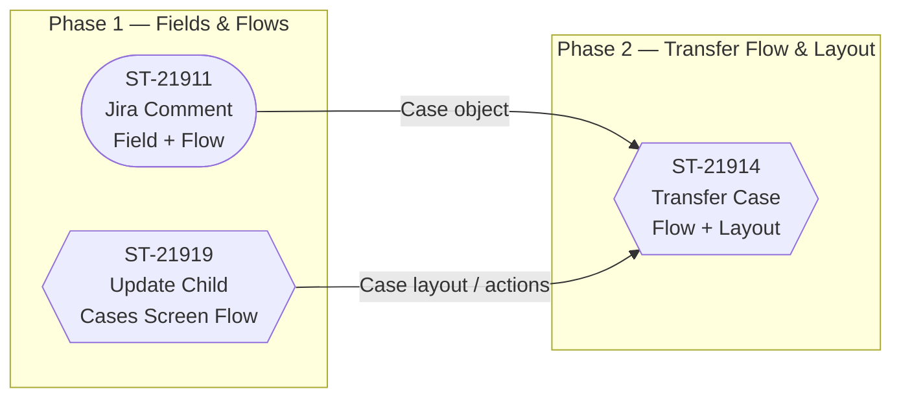

# Orchestration Plan

## Summary

ST-21911 (Jira comment field + record-triggered flow) and ST-21919 (Update Child Cases screen flow) build in parallel in Phase 1; ST-21914 (Transfer Case screen flow + layout/flexipage edits) runs alone in Phase 2 to avoid Case layout merge conflicts.

## Diagram

## Phases (sequence groups)

### Phase 1 — parallel

- **ST-21911: Jira Comments Update Salesforce Case** ← builtin-sf-developer · branch `agent/st-21911-jira-comment-case-update`
  *Why:* Requires a new Case DateTime field and a record-triggered Flow with conditional logic and Chatter integration — core Salesforce metadata and Flow development.
- **ST-21919: Update all Child Cases** ← builtin-sf-developer · branch `agent/st-21919-update-child-cases`
  *Why:* Screen Flow with child-Case collection loop, conditional Chatter visibility, and a Quick Action button — standard Flow and metadata work with no layout overlap in Phase 1.

### Phase 2

- **ST-21914: Transfer Case** ← builtin-sf-developer · branch `agent/st-21914-transfer-case`
  *Why:* Screen Flow plus Quick Action creation and explicit Production Support Layout and Case_support_lightning_page flexipage edits — must run after ST-21919 to prevent concurrent layout conflicts.

## Conflicts detected

- **ST-21919: Update all Child Cases** and **ST-21914: Transfer Case**: Both slices add Quick Actions to the Case object and are likely to modify overlapping metadata files: the Production Support Layout and the Case_support_lightning_page flexipage.. *Recommendation:* sequential.

## Phase outcomes

_Slice summaries append into per-phase blocks below as work completes._

### Phase 1

<!-- BEGIN cheese:phase-1 -->
- ✅ ST-21911: Jira Comments Update Salesforce Case — *summary saved 2026-06-02*. [Decisions & details](docs/slices/conv-1780420472030-st-21911-jira-comments-update-salesforce-case.md). Lesson: Using a DateTime stamp field (`Last_Jira_Comment_Date_Time__c`) as the flow trigger is more reliable than firing from a platform event or invoking Chatter from within the REST endpoint — it survives async boundaries and is easy to re-trigger manually in testing..
- ⏳ ST-21919: Update all Child Cases — ready-to-start
<!-- END cheese:phase-1 -->

### Phase 2

<!-- BEGIN cheese:phase-2 -->
- ⏳ ST-21914: Transfer Case — ready-to-start
<!-- END cheese:phase-2 -->

## Changelog

<!-- BEGIN cheese:changelog -->
- 2026-06-02 — Initial plan.
<!-- END cheese:changelog -->

## Shared context (prepended to agent runs)

This project implements Service Cloud automation for a Brands team with Case as the central object. Custom Case fields in play include Platform__c, Block_Jira_Updates__c, Organization__c, and Organization_Contact__c; all new flows should follow the 'Brands - Case, [Action Name]' naming convention. ST-21911 introduces a new DateTime field on Case and a record-triggered flow; ST-21919 and ST-21914 both add Quick Actions to the Case object and likely touch the Production Support Layout and Case_support_lightning_page flexipage — these must be sequenced to prevent metadata merge conflicts. No slice requires another's output as a hard prerequisite, but layout serialization risk drives the sequencing below.
