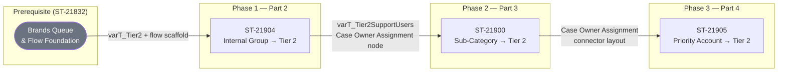

# Project Brief

## Goals

- Establish brand-segmented Omni-Channel case queues with correct routing priority so that urgent cases are always surfaced before standard cases.
- Automate escalation of internally-sourced cases to Tier 2 support queues via a reusable Salesforce Flow scaffold, eliminating manual reassignment.
- Automate routing of cases matching defined sub-categories to Tier 2, ensuring specialists receive the right case type without agent intervention.
- Automate escalation of cases tied to Priority Attention Accounts to Tier 2, enforcing SLA commitments for high-value customers.
- Create the custom Case fields required for accurate routing conditions and downstream data migration.

## Non-goals

- Direct CLI or CHEESE-button deployment to the production org — all production deploys run through the GitHub Actions pipeline on PR merge.
- Migration or transformation of existing historical Case records.
- Tier 3 or higher escalation logic — scope ends at Tier 2 assignment.
- Changes to objects outside the Case Automation and Case Data Migration epics (e.g., Opportunity, Account field changes unrelated to routing criteria).

## Architecture

The solution is anchored on the Salesforce **Case** object and **Omni-Channel** routing. ST-21832 (the prerequisite slice) creates the Brands Queue with Omni-Channel routing configuration — lower `routingPriority` numbers (10, 20) for urgent queues and higher numbers (40, 50) for standard queues — and scaffolds a Case record-triggered Flow containing the `varT_Tier2` collection variable. Every subsequent slice adds decision nodes and assignments to this single shared Flow rather than spawning parallel flows, preserving a single routing path and a predictable execution order.

Custom Case fields created in ST-22674 supply the field values that the routing decisions in Phases 1–3 evaluate. This makes ST-22674 a soft prerequisite for the logic slices: the fields must be deployed and populated before the routing conditions can fire correctly in production.

Each routing phase appends to the Flow in sequence — internal group detection (ST-21904) populates `varT_Tier2SupportUsers`; sub-category matching (ST-21900) feeds the Case Owner Assignment node built in Phase 1; Priority Account detection (ST-21905) uses the connector layout established in Phase 2. No phase replaces logic from a prior phase.

## Target users

- **Tier 1 Support Agents** — receive and triage inbound cases; benefit from automatic routing reducing manual queue transfers. See [docs/Personas.md](docs/Personas.md).
- **Tier 2 Support Specialists** — receive pre-qualified escalated cases from queues; no manual hand-off required. See [docs/Personas.md](docs/Personas.md).
- **Service / Queue Managers** — configure queue membership and monitor routing rule health. See [docs/Personas.md](docs/Personas.md).
- **Salesforce Administrators** — maintain Omni-Channel configuration, queue membership, and Flow versions over time. See [docs/Personas.md](docs/Personas.md).

## Slice index

| Slice | Status | Doc | Persona served |
|---|---|---|---|
| ST-21832: Case Queues (Part 1) | pr-created | [docs/slices/ST-21832.md](docs/slices/ST-21832.md) | Salesforce Administrator, Queue Manager |
| ST-22674: Field Creation | pr-created | [docs/slices/ST-22674.md](docs/slices/ST-22674.md) | Salesforce Administrator |
| ST-21904: Internal Route to Tier 2 (Part 2) | ready-to-start | [docs/slices/ST-21904.md](docs/slices/ST-21904.md) | Tier 1 Agent, Tier 2 Specialist |
| ST-21900: Case Sub-Categories Route to Tier 2 (Part 3) | ready-to-start | [docs/slices/ST-21900.md](docs/slices/ST-21900.md) | Tier 1 Agent, Tier 2 Specialist |
| ST-21905: Priority Attention Account (Part 4) | ready-to-start | [docs/slices/ST-21905.md](docs/slices/ST-21905.md) | Tier 2 Specialist, Service Manager |

## Risks & open questions

- **(2026-06-02)** `varT_Tier2SupportUsers` population logic is not yet specified in the available slice detail — if the collection is empty at runtime the Case Owner Assignment node may silently no-op, leaving cases unassigned.
- **(2026-06-02)** The exact sub-category picklist values that trigger Tier 2 routing (ST-21900) have not been enumerated; if new sub-categories are added after deploy without updating the Flow, cases will fall through to the wrong queue.
- **(2026-06-02)** "Priority Attention Account" criteria are not defined in the ST-21905 slice detail — whether this is a checkbox field, a record type, or an account tier field must be confirmed before implementation begins.
- **(2026-06-02)** ST-22674 (field creation) and ST-21832 (queue/flow foundation) are both in `pr-created` status; if either PR merge is delayed, Phase 1–3 slices cannot safely deploy to the sandbox for testing.
- **(2026-06-02)** Brand queue membership governance is undocumented — no process currently exists for adding or removing agents from brand queues as the support org changes, creating a long-term operational risk.

<!-- BEGIN cheese:slice-index -->
| Slice | Status | Doc | Persona served |
| --- | --- | --- | --- |
| ST-21905: Priority Attention Account (part 4) | deployed | [view](docs/slices/conv-1780411822782-st-21905-priority-attention-account-part-4.md) | (see file) |
| ST-21900: Case Sub-Categories Route to Tier 2 (Part 3) | pr-created | [view](docs/slices/conv-1780411821832-st-21900-case-sub-categories-route-to-tier-2-part-.md) | (see file) |
| ST-21904: Internal Route to Tier 2 (Part 2) | pr-created | [view](docs/slices/conv-1780411803098-st-21904-internal-route-to-tier-2-part-2.md) | (see file) |
| # ST-21832: Case Queues (Part 1)
**Statu | pr-created | [view](docs/slices/conv-1780338159721-st-21832-case-queues-part-1-statu.md) | (see file) |
| # ST-22674: ST-21903 \| Rithum \| Field Cr | pr-created | [view](docs/slices/conv-1780333762821-st-22674-st-21903-rithum-field-cr.md) | (see file) |
<!-- END cheese:slice-index -->
