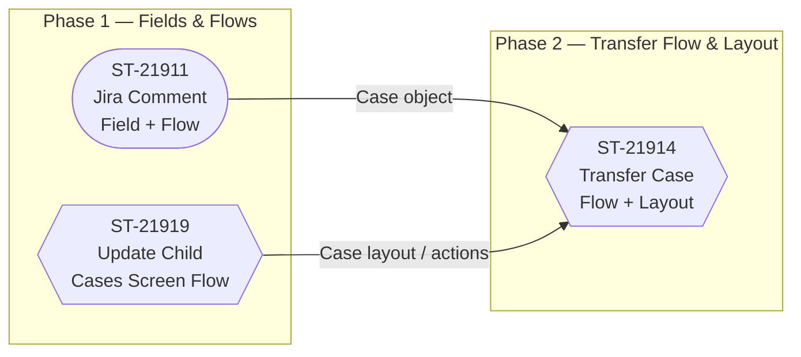

# Project Brief

## Goals

- Surface Jira comments on the associated Salesforce Case record in real time, eliminating manual copy-paste between systems and giving agents a single pane of glass for case context.
- Route new cases to the correct Tier 1 or Tier 2 queue automatically based on case sub-category, internal origin flag, and priority-attention logic — reducing triage time and misrouted work.
- Give service agents a guided, error-resistant screen flow for transferring a case to another team or queue, replacing ad-hoc field edits on the record page.
- Propagate updates made to a parent case down to all child cases automatically, keeping related records consistent without requiring agents to touch each one.
- Notify the Account Team when case ownership or status changes that affect their accounts, so that relationship owners are never caught off guard by escalations.

## Non-goals

- **Outbound Jira write-back:** creating or updating Jira tickets from Salesforce is not in scope; the integration is inbound-only (Jira → Salesforce).
- **Production org deployments:** no changes are promoted to Production until explicit in-chat go-live confirmation is given; all current work targets sandbox environments.
- **Experience Cloud / self-service portal:** no customer-facing portal changes are included in this project.
- **Reporting and dashboards:** building or modifying reports, list views, or dashboards is out of scope unless a slice explicitly requires one as acceptance criteria.

## Architecture

The solution is built entirely on **Salesforce Service Cloud** with the `Case` object as the central record. Custom fields added in ST-22674 (field creation slice) provide the data foundation for downstream routing, notification, and integration logic. All case lifecycle automation — queue assignment, Tier 2 routing, priority-attention escalation, child-case propagation, and account-team notification — is implemented as declarative **Record-Triggered Flows** and **Screen Flows** so that logic is maintainable without Apex where possible.

The Jira integration (ST-21911) uses an inbound mechanism — a Jira webhook or middleware post — that writes a comment payload to the Case record, likely via a custom `Case Comment` record or a dedicated rich-text field. No Apex callout is required on the Salesforce side; the integration layer pushes data in. The Transfer Case flow (ST-21914) adds a **quick action** to the Case layout and invokes a Screen Flow that validates the target queue before reassigning, ensuring agents cannot transfer without required information.

Phase 1 must complete before Phase 2 because the Transfer Case flow and its layout changes depend on the fields and flow infrastructure laid down by the Jira comment slice (ST-21911) and the Update Child Cases screen flow (ST-21919). The dependency graph is as follows:

## Target users

See `docs/Personas.md` for full persona definitions.

- **Tier 1 Service Agent** — handles inbound case triage, uses queue views and routing outputs daily
- **Tier 2 Service Agent** — receives escalated cases routed by sub-category or internal flag
- **Case Owner / Account Team Member** — notified of ownership changes; primary relationship holder for the account
- **Service Supervisor / Team Lead** — monitors case queues and priority-attention accounts; benefits from propagation and routing automation
- **Jira (integration actor)** — external system that posts comments into Salesforce via webhook

## Slice index

| Slice | Status | Doc | Persona served |
|---|---|---|---|
| ST-21832: Case Queues (Part 1) | PR Created | [docs/slices/ST-21832.md](docs/slices/ST-21832.md) | Tier 1 Service Agent, Service Supervisor |
| ST-21904: Internal Route to Tier 2 (Part 2) | PR Created | [docs/slices/ST-21904.md](docs/slices/ST-21904.md) | Tier 1 Service Agent, Tier 2 Service Agent |
| ST-21900: Case Sub-Categories Route to Tier 2 (Part 3) | PR Created | [docs/slices/ST-21900.md](docs/slices/ST-21900.md) | Tier 1 Service Agent, Tier 2 Service Agent |
| ST-21905: Priority Attention Account (Part 4) | PR Created | [docs/slices/ST-21905.md](docs/slices/ST-21905.md) | Service Supervisor, Account Team Member |
| ST-22674: Field Creation | PR Created | [docs/slices/ST-22674.md](docs/slices/ST-22674.md) | All personas (foundational data layer) |
| ST-21906: Notify Account Team | In Progress | [docs/slices/ST-21906.md](docs/slices/ST-21906.md) | Case Owner, Account Team Member |
| ST-21911: Jira Comments Update Salesforce Case | Ready to Start | [docs/slices/ST-21911.md](docs/slices/ST-21911.md) | Tier 1 & Tier 2 Service Agent |
| ST-21919: Update all Child Cases | Ready to Start | [docs/slices/ST-21919.md](docs/slices/ST-21919.md) | Tier 1 Service Agent, Service Supervisor |
| ST-21914: Transfer Case | Ready to Start | [docs/slices/ST-21914.md](docs/slices/ST-21914.md) | Tier 1 & Tier 2 Service Agent |

## Risks & open questions

- **(2026-06-02) ST-21911 and ST-21919 are past their due dates (2026-05-07).** Both are still "Ready to Start." Impact to Phase 2 (ST-21914) needs to be re-assessed and due dates renegotiated with stakeholders.
- **(2026-06-02) No org sync is available.** Custom fields assumed by the routing and notification slices cannot be verified against the actual org schema. Risk of deploy failures if fields referenced in flows don't exist or have different API names.
- **(2026-06-02) PR-Created slices show "Not Started" in the ticket system.** It is unclear whether these PRs have been reviewed and merged, or whether they are open/stalled. Status discrepancy needs resolution before Phase 1 is declared complete.
- **(2026-06-02) Jira webhook authentication and payload schema are undefined.** The ST-21911 implementation cannot be finalized until the Jira-side contract (auth token, payload format, retry behavior) is confirmed with the integration owner.
- **(2026-06-02) ST-21906 (Notify Account Team) is in progress with no documented blocker or assignee in the provided slice data.** If this slice is blocked, the Account Team persona has no completed deliverable and the risk of go-live without that notification path should be acknowledged.
- **(2026-06-02) "Update all Child Cases" scope is ambiguous** — the slice description is truncated. It is unclear whether all field changes on a parent trigger propagation or only specific fields, which affects the flow's governor limit profile on accounts with large case hierarchies.
